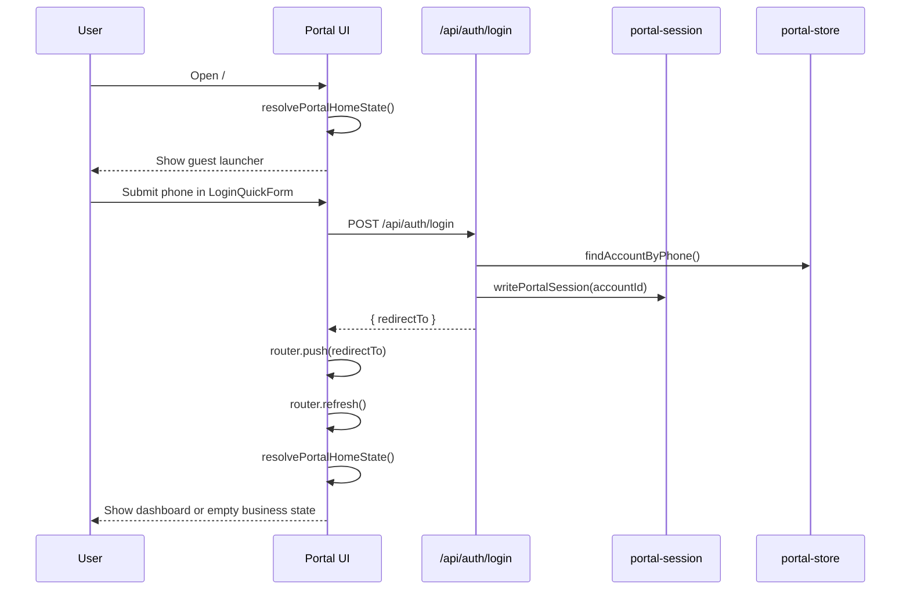
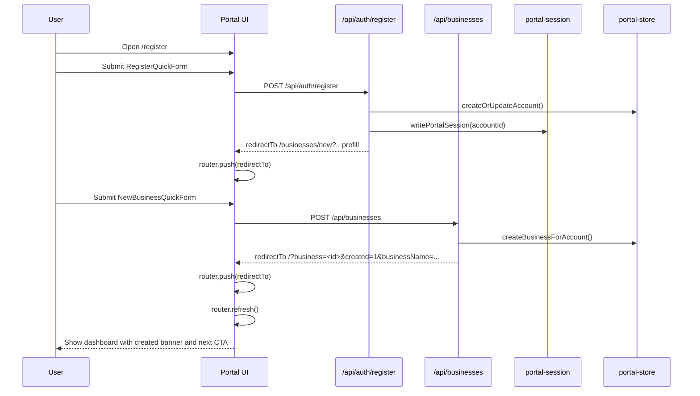

# Frontend Usaha Reference

This document is an AI-ready reference for `frontend/usaha`, the app served at `http://localhost:3003` in local development.

## Table of Contents

1. Executive Summary
2. App Mental Model
3. High-Level Architecture
4. End-to-End Flows
5. Global Shell and Navigation
6. Route and Page Mapping
7. Page-by-Page Reference
8. Core Logic That Drives the UX
9. Data Layer, Session, and Demo Model
10. API and Mutation Reference
11. Known Limitations and AI Caveats
12. Files to Read First

## 1. Executive Summary

- `http://localhost:3003` points to `frontend/usaha`, not `frontend/www`.
- `frontend/www` links into this app through `buildUsahaPath()` in `frontend/www/src/lib/umkmSurface.ts`.
- In development, the `usaha` service is started on port `3003` by `docker-compose.dev.yml`.
- The app is demo-first and in-memory. There is no persistent database, no external auth provider, and no backend service dedicated to this portal yet.
- Session state is stored in an HTTP-only cookie named `usaha_session`.
- Most UX decisions are computed dynamically from business state, role, and permissions instead of being hardcoded page by page.

### Integration boundary with `frontend/www`

- `frontend/www` can deep-link users into the business portal via `buildUsahaPath()`.
- Example: `frontend/www/src/app/[locale]/(shared)/support/page.tsx` includes a "Toko / katalog / operasional" support path that points to `buildUsahaPath('home')`.
- The business portal itself does not render inside `frontend/www`; it is a separate Next.js app.

## 2. App Mental Model

### What this app is

- A focused business operations portal for owners, managers, cashiers, and viewers.
- A guided workflow app, not a generic menu-heavy admin panel.
- A demoable portal that supports both guest preview mode and logged-in account mode.

### What this app is not

- Not the public marketplace app.
- Not the support ticket system from `frontend/www`.
- Not backed by a persistent API/database layer.
- Not a full production auth system. Login is by phone lookup only.

### Root entry states

The root route `/` is resolved by `resolvePortalHomeState()` in `frontend/usaha/src/lib/portal-server.ts`.

| State | Condition | Result |
| --- | --- | --- |
| Guest launcher | No session and no `?business=` query | Shows landing launcher with quick login, register, create-business entry points |
| Guest demo mode | No session and valid `?business=<seed-id>` | Shows full portal using seed demo business data |
| Logged in, no business | Session exists but account has no memberships | Shows empty state prompting user to create the first business |
| Logged in, has business | Session exists and account has memberships | Shows full dashboard for active business |

### Business route resolution

For detailed business routes such as `/businesses/[businessId]/products`, the app uses `resolvePortalBusinessPageState()` in `frontend/usaha/src/lib/portal-server.ts`.

- If the session account owns or can access that business, the page uses the account-scoped business view.
- If not, but the `businessId` matches a seed/demo business, the page falls back to demo data.
- If neither exists, the page renders `notFound()`.

This means guest users can browse seeded detailed pages too, not only the root demo dashboard.

## 3. High-Level Architecture

| Layer | Main files | Responsibility |
| --- | --- | --- |
| App shell | `frontend/usaha/src/components/portal/PortalShell.tsx` | Shared portal layout, header, 3-step cards, nav, business switcher, mobile nav |
| Entry/state resolution | `frontend/usaha/src/lib/portal-server.ts` | Decides guest vs logged-in vs demo mode and active business |
| UX decision engine | `frontend/usaha/src/lib/portal-logic.ts` | Computes progress, primary CTA, task cards, management menu, section links |
| Store and mutations | `frontend/usaha/src/lib/portal-store.ts` | In-memory account/business store and all business mutations |
| Session/auth | `frontend/usaha/src/lib/portal-session.ts`, `frontend/usaha/src/app/api/auth/*` | Cookie session read/write/clear and auth endpoints |
| Seed data and roles | `frontend/usaha/src/lib/portal-data.ts`, `frontend/usaha/src/lib/portal-types.ts` | Roles, permissions, role summaries, seed businesses, seed accounts |
| Per-page UI | `frontend/usaha/src/app/(portal)/*`, `frontend/usaha/src/app/(auth)/*` | Route-level rendering for auth, dashboard, business pages, security |
| Client-side form actions | `frontend/usaha/src/components/forms/*` | Submit mutations, show inline errors/success, redirect, `router.refresh()` |

## 4. End-to-End Flows

### 4.1 Guest -> Login -> Dashboard



### 4.2 Guest -> Register -> Create Business -> Dashboard



### 4.3 Returning user flow

1. User opens `/`.
2. `readPortalSession()` checks `usaha_session`.
3. `resolvePortalHomeState()` loads account memberships.
4. Active business is:
   - the explicit `?business=` query if it belongs to the account, otherwise
   - the first business membership.
5. Dashboard renders with computed primary action, progress, tasks, and menu groups.

### 4.4 Guest demo flow

1. User opens `/?business=warung-barokah` or another seed business id.
2. No session is required.
3. `resolvePortalHomeState()` loads seed business data instead of account data.
4. The guest can inspect the portal as if the business existed.
5. Detailed routes such as `/businesses/kopi-santai/products` also work via seed fallback.

### 4.5 Continue setup flow

Once a business exists, the portal tries to push the user forward through this sequence:

1. Complete business info
2. Add first product
3. Open or configure operations
4. Start handling orders/reservations if present
5. Invite team and review security/access

The exact next step is computed by `getPrimaryAction()` and `getTaskCards()` in `portal-logic.ts`.

### 4.6 Root `/` decision matrix

| Condition | Resolver output | Rendered state | Main CTA direction |
| --- | --- | --- | --- |
| No session, no `business` query | `account=null`, `activeBusiness=null`, `isAuthenticated=false` | Guest launcher | Login / register / create business |
| No session, `business=<seed-id>` | `account=null`, `activeBusiness=<seed business>`, `isAuthenticated=false` | Guest demo dashboard | Continue setup/daily flow for seed business |
| Session exists, no memberships | `account=<session account>`, `activeBusiness=null`, `isAuthenticated=true` | Empty business state | Create first business |
| Session exists, memberships, no query | `account=<session account>`, `activeBusiness=businesses[0]` | Full dashboard | Computed by primary CTA logic |
| Session exists, memberships, valid `business` query | `account=<session account>`, `activeBusiness=<queried business>` | Full dashboard scoped to selected business | Computed by primary CTA logic |
| Session exists, invalid `business` query | Fallback to first membership | Full dashboard scoped to fallback business | Computed by primary CTA logic |

## 5. Global Shell and Navigation

### 5.1 Root layout vs auth pages vs portal pages

- `frontend/usaha/src/app/layout.tsx` only provides the global HTML/body shell and metadata.
- Auth pages `/login` and `/register` do **not** use `PortalShell`.
- Portal pages and even the guest launcher/empty state **do** use `PortalShell`.

### 5.2 `PortalShell` responsibilities

`PortalShell` is the main structural component for the portal experience. It receives:

- `activeBusiness`
- `availableBusinesses`
- `viewerName`
- `currentSection`
- `children`

It is responsible for:

- Section-aware header title and description
- Primary and secondary CTA in the header
- 3-step flow cards
- Desktop sidebar nav grouped into:
  - `Mulai dari sini`
  - `Siapkan usaha`
  - `Jalankan harian`
  - `Tim dan akses`
- Business switcher for multi-business accounts
- Account card and logout button
- Mobile horizontal chip nav near the header
- Mobile bottom navigation

### 5.3 Header

The header appears on all portal-shell pages.

It contains:

- Current section meta, such as "Beranda usaha" or "Produk"
- Large business name or guest headline
- Context chips:
  - role
  - status
  - city
  - schedule
- A "Kalau mau lanjut cepat" CTA card with:
  - primary CTA
  - secondary CTA
  - viewer name when logged in
- Three flow cards representing the current business journey

### 5.4 Sidebar

Desktop only.

It contains:

- Portal brand block
- Active business summary or guest prompt
- Account state:
  - login/register actions for guests
  - active account + logout for logged-in users
- Business switcher when multiple businesses are available
- Grouped navigation items:
  - Beranda
  - Info usaha
  - Produk
  - Halaman pembeli
  - Pesanan
  - Operasional
  - Tim
  - Keamanan

The sidebar is context-aware:

- Links are built from `currentSection` and `activeBusiness`
- Switching businesses keeps the current section when possible
- The active business card and nav highlight update dynamically

### 5.5 Mobile navigation

There are two mobile navigation patterns:

- A chip-style horizontal nav under the header for all route sections
- A fixed bottom nav for quick access to:
  - home
  - products
  - orders
  - operations
  - team

The bottom nav is mobile-only.

### 5.6 Flow cards

The three cards are the portal's main orientation device.

### Guest mode cards

1. Masuk atau daftar
2. Buat usaha
3. Isi dan jalankan

### Logged-in business cards

1. Siapkan usaha
2. Jalankan harian
3. Jaga tim dan akses

These cards are computed by `getFlowCards()` in `PortalShell.tsx`, not page-by-page manually.

### 5.7 Loading and error conventions

- The app currently has no dedicated `loading.tsx` route files in `frontend/usaha`.
- Most user feedback is inline at the form level:
  - pending button label changes such as `Masuk...`, `Lanjut...`, or `Menyimpan...`
  - inline error text under the form
  - inline success text before redirect or refresh
- Invalid business routes fall back to the shared `not-found` page.
- Most page-level data resolution happens server-side before render, so route transitions mainly rely on Next.js navigation plus `router.refresh()`.

### 5.8 Dashboard component inventory

These components make up the main dashboard experience on `/`.

| Component | File | Role in UX |
| --- | --- | --- |
| `PortalShell` | `frontend/usaha/src/components/portal/PortalShell.tsx` | Global frame, header, nav, flow cards, business switcher |
| `PrimaryActionCard` | `frontend/usaha/src/components/portal/PrimaryActionCard.tsx` | Main recommended next action plus quick business health summary |
| `ProgressTracker` | `frontend/usaha/src/components/portal/ProgressTracker.tsx` | Setup progress visualization |
| `TaskBoard` | `frontend/usaha/src/components/portal/TaskBoard.tsx` | Top-priority current tasks |
| `ManagementGrid` | `frontend/usaha/src/components/portal/ManagementGrid.tsx` | Structured menu by setup/daily/team groups |
| `RoleAccessCard` | `frontend/usaha/src/components/portal/RoleAccessCard.tsx` | Explains current role capabilities and restrictions |
| `TeamSnapshot` | `frontend/usaha/src/components/portal/TeamSnapshot.tsx` | Short team/member/invite overview |
| `StatsGrid` | `frontend/usaha/src/components/portal/StatsGrid.tsx` | Compact KPI-like portal metrics |
| `PortfolioPanel` | `frontend/usaha/src/components/portal/PortfolioPanel.tsx` | Multi-business context switch panel |
| `SectionCard` | `frontend/usaha/src/components/portal/SectionCard.tsx` | Shared section wrapper for page modules |

### 5.9 Form component inventory

| Form component | File | Calls API | Primary purpose |
| --- | --- | --- | --- |
| `LoginQuickForm` | `frontend/usaha/src/components/forms/LoginQuickForm.tsx` | `POST /api/auth/login` | Start a session from a phone number |
| `RegisterQuickForm` | `frontend/usaha/src/components/forms/RegisterQuickForm.tsx` | `POST /api/auth/register` | Create/update account and redirect to create business |
| `NewBusinessQuickForm` | `frontend/usaha/src/components/forms/NewBusinessQuickForm.tsx` | `POST /api/businesses` | Create a new business |
| `BusinessInfoQuickForm` | `frontend/usaha/src/components/forms/BusinessInfoQuickForm.tsx` | `PATCH /api/businesses/[businessId]` | Update business identity/profile |
| `ProductQuickForm` | `frontend/usaha/src/components/forms/ProductQuickForm.tsx` | `POST /api/businesses/[businessId]/products` | Add a product |
| `OperationsQuickForm` | `frontend/usaha/src/components/forms/OperationsQuickForm.tsx` | `PATCH /api/businesses/[businessId]/operations` | Update schedule and open/closed state |
| `InviteMemberQuickForm` | `frontend/usaha/src/components/forms/InviteMemberQuickForm.tsx` | `POST /api/businesses/[businessId]/team/invites` | Create pending invite |

## 6. Route and Page Mapping

| Route | File | Resolver / data source | Main user action | API / mutation | Typical next step |
| --- | --- | --- | --- | --- | --- |
| `/` | `frontend/usaha/src/app/(portal)/page.tsx` | `resolvePortalHomeState()` | Login, register, create business, continue setup | None directly on page | Depends on root state and computed CTA |
| `/login` | `frontend/usaha/src/app/(auth)/login/page.tsx` | Local client state only | Submit login form | `POST /api/auth/login` | Redirect to first business or `/businesses/new` |
| `/register` | `frontend/usaha/src/app/(auth)/register/page.tsx` | Local client state only | Submit register form | `POST /api/auth/register` | Redirect to `/businesses/new` with prefill |
| `/businesses/new` | `frontend/usaha/src/app/(portal)/businesses/new/page.tsx` | `getPortalAccount()`, `getPortalBusinesses()` | Submit create-business form | `POST /api/businesses` | Redirect to `/?business=<id>&created=1...` |
| `/businesses/[businessId]/info` | `frontend/usaha/src/app/(portal)/businesses/[businessId]/info/page.tsx` | `resolvePortalBusinessPageState()` | Edit info or inspect profile | `PATCH /api/businesses/[businessId]` | Usually products |
| `/businesses/[businessId]/products` | `frontend/usaha/src/app/(portal)/businesses/[businessId]/products/page.tsx` | `resolvePortalBusinessPageState()` | Add first/next product | `POST /api/businesses/[businessId]/products` | Usually operations |
| `/businesses/[businessId]/operations` | `frontend/usaha/src/app/(portal)/businesses/[businessId]/operations/page.tsx` | `resolvePortalBusinessPageState()` | Set schedule and open status | `PATCH /api/businesses/[businessId]/operations` | Orders or dashboard |
| `/businesses/[businessId]/orders` | `frontend/usaha/src/app/(portal)/businesses/[businessId]/orders/page.tsx` | `resolvePortalBusinessPageState()` | Inspect queue | None | Operations or remain in daily work |
| `/businesses/[businessId]/team` | `frontend/usaha/src/app/(portal)/businesses/[businessId]/team/page.tsx` | `resolvePortalBusinessPageState()` | Invite member or inspect team | `POST /api/businesses/[businessId]/team/invites` | Security or back to dashboard |
| `/businesses/[businessId]/buyer-page` | `frontend/usaha/src/app/(portal)/businesses/[businessId]/buyer-page/page.tsx` | `resolvePortalBusinessPageState()` | Open public storefront | None | Info, operations, or dashboard |
| `/security` | `frontend/usaha/src/app/(portal)/security/page.tsx` | `resolvePortalHomeState()` unless `state=guest` | Inspect security concepts and events | None | Team page or dashboard |
| `not-found` | `frontend/usaha/src/app/not-found.tsx` | Next.js not-found fallback | Return home | None | `/` |

### 6.1 Resolver map

| Resolver | File | Used by |
| --- | --- | --- |
| `resolvePortalHomeState(searchParams)` | `frontend/usaha/src/lib/portal-server.ts` | `/`, `/security` |
| `resolvePortalBusinessPageState(businessId)` | `frontend/usaha/src/lib/portal-server.ts` | `info`, `products`, `operations`, `orders`, `team`, `buyer-page` |
| `getPortalAccount()` | `frontend/usaha/src/lib/portal-server.ts` | `/businesses/new` |
| `getPortalBusinesses()` | `frontend/usaha/src/lib/portal-server.ts` | `/businesses/new` |

## 7. Page-by-Page Reference

### 7.1 Page: Dashboard Root

**Route:** `/`  
**File:** `frontend/usaha/src/app/(portal)/page.tsx`

**Purpose:**  
Main entry point for the portal. This route decides which macro-state the user sees.

**State resolver:**  
`resolvePortalHomeState()` from `frontend/usaha/src/lib/portal-server.ts`

**Possible states:**

- Guest launcher
- Guest demo dashboard
- Logged-in empty state
- Logged-in full dashboard

**Main UI in guest launcher:**

- 3-step intro cards
- Quick login card with `LoginQuickForm`
- Register link
- Create-business link
- Guest highlight cards
- Demo business shortcuts

**Main UI in empty business state:**

- "Belum ada usaha" explanation
- CTA to `/businesses/new`
- Post-create expectations

**Main UI in full dashboard state:**

- Optional created-success banner when `created=1`
- `PrimaryActionCard`
- `ProgressTracker`
- `TaskBoard`
- `ManagementGrid`
- `RoleAccessCard`
- `TeamSnapshot`
- `StatsGrid`
- `PortfolioPanel`

**Primary actions:**

- Login
- Register
- Create first business
- Continue the next setup or daily-work step
- Switch business context

**State/data sources:**

- Account/session from `portal-session.ts`
- Business data from `portal-store.ts`
- Derived UI logic from `portal-logic.ts`

**Mutations called directly from this page:**

- None

**Next-step behavior:**

- Controlled by `getPrimaryAction()`
- Task ordering is controlled by `getTaskCards()`
- Progress bar is controlled by `getProgressSteps()`

**Notes:**

- This is the most important page for understanding the app's UX model.
- The dashboard itself is mostly a navigation and prioritization surface, not a data-entry page.

### 7.2 Page: Login

**Route:** `/login`  
**File:** `frontend/usaha/src/app/(auth)/login/page.tsx`

**Purpose:**  
Standalone login page for quick account access.

**Main UI:**

- Intro copy
- `LoginQuickForm`
- Links to:
  - `/register`
  - `/businesses/new`
- Right-hand helper cards on desktop

**Main form fields:**

- `phone`

**Primary action:**

- Submit `LoginQuickForm`

**API called:**

- `POST /api/auth/login`

**Redirect behavior:**

- To `/?business=<first-membership-id>` if the account has businesses
- To `/businesses/new` if the account has no business yet

**Error handling:**

- Inline error text from the form
- No separate error page

**Notes:**

- Login is not password-based.
- The form simply checks whether the phone exists in the in-memory store.

### 7.3 Page: Register

**Route:** `/register`  
**File:** `frontend/usaha/src/app/(auth)/register/page.tsx`

**Purpose:**  
Creates or updates an account, then pushes the user into business creation.

**Main UI:**

- Intro copy
- `RegisterQuickForm`
- Link back to `/login`
- Role/access benefit cards

**Main form fields:**

- `name`
- `phone`
- `email`

**Primary action:**

- Submit `RegisterQuickForm`

**API called:**

- `POST /api/auth/register`

**Redirect behavior:**

- Redirects to `/businesses/new` with owner prefill query params

**Notes:**

- Registration also writes the session cookie immediately.
- If the phone already exists, `createOrUpdateAccount()` updates the existing account instead of creating a duplicate.

### 7.4 Page: New Business

**Route:** `/businesses/new`  
**File:** `frontend/usaha/src/app/(portal)/businesses/new/page.tsx`

**Purpose:**  
Creates a new business and then redirects to the business dashboard.

**Entry logic:**

- Reads the current portal account via `getPortalAccount()`
- Loads existing businesses via `getPortalBusinesses()`
- Prefills owner fields from:
  - query params from register redirect, or
  - the current account

**Main UI:**

- `PortalShell`
- Create-business section card
- `NewBusinessQuickForm`
- Sidebar guidance and auth links

**Main form fields:**

- `businessName`
- `category`
- `city`
- `address`
- `phone`
- `ownerName`
- `ownerEmail`

**Primary action:**

- Submit create-business form

**API called:**

- `POST /api/businesses`

**Redirect behavior:**

- Redirects to `/?business=<id>&created=1&businessName=<name>`

**Completion meaning:**

- A new business is created
- The account gets an owner membership
- The new business becomes the active dashboard context

**Notes:**

- If no session exists, `POST /api/businesses` can create an account inline as long as owner data is present.
- This page uses `PortalShell`, so it already feels like part of the portal journey rather than a disconnected onboarding form.

### 7.5 Page: Business Info

**Route:** `/businesses/[businessId]/info`  
**File:** `frontend/usaha/src/app/(portal)/businesses/[businessId]/info/page.tsx`

**Purpose:**  
Edit or inspect the core business identity used by buyers, staff, and portal logic.

**State resolver:**

- `resolvePortalBusinessPageState(businessId)`

**Permission behavior:**

- If the user has `manageInfo`, show editable form
- Otherwise show read-only summary

**Main UI sections:**

- Section header with CTA to products
- Editable or read-only business info card
- Buyer preview card
- Profile status summary
- Quick checklist card

**Main editable fields:**

- `name`
- `category`
- `city`
- `address`
- `phone`
- `description`
- `schedule`

**API called:**

- `PATCH /api/businesses/[businessId]`

**Completion meaning:**

- This page contributes to `infoComplete`
- `infoComplete` is derived from name/category/city/address/phone being present

**Portal effect:**

- If business info is incomplete, the root dashboard's primary CTA usually points here first

### 7.6 Page: Products

**Route:** `/businesses/[businessId]/products`  
**File:** `frontend/usaha/src/app/(portal)/businesses/[businessId]/products/page.tsx`

**Purpose:**  
Manage the product catalog and help the storefront become buyer-ready.

**Permission behavior:**

- If the user has `manageProducts`, show add-product form
- Otherwise show read-only access explanation

**Main UI sections:**

- Product/setup summary stats
- Add-product card
- Product list cards
- Empty state when there are no products
- CTA to operations

**Main form fields:**

- `name`
- `category`
- `priceLabel`
- `stockLabel`

**API called:**

- `POST /api/businesses/[businessId]/products`

**Completion meaning:**

- Having at least 1 product means `productsCount > 0`
- `buyerPageReady` becomes true when:
  - `infoComplete === true`
  - `productsCount > 0`

**Portal effect:**

- If business info is already complete but products are still empty, the dashboard's next CTA usually points here

**Important caveat:**

- The current page supports adding products only; there is no edit/delete flow yet.

### 7.7 Page: Operations

**Route:** `/businesses/[businessId]/operations`  
**File:** `frontend/usaha/src/app/(portal)/businesses/[businessId]/operations/page.tsx`

**Purpose:**  
Control open/closed state, working schedule, and display reservation context.

**Permission behavior:**

- If the user has `manageOperations`, show editable operations form
- Otherwise show current status only

**Main UI sections:**

- Operations form or read-only status
- Quick-check guidance card
- Status/reservation summary stats
- Reservation list
- CTA to orders

**Main form fields:**

- `schedule`
- `isOpen`

**API called:**

- `PATCH /api/businesses/[businessId]/operations`

**Completion meaning:**

- This page controls the "Usaha dibuka" progress step through `isOpen`

**Portal effect:**

- If info and products are already ready but the business is still closed, the dashboard's next CTA often points here

**Important caveat:**

- Reservations are read-only seed/in-memory data right now. There is no reservation mutation flow yet.

### 7.8 Page: Orders

**Route:** `/businesses/[businessId]/orders`  
**File:** `frontend/usaha/src/app/(portal)/businesses/[businessId]/orders/page.tsx`

**Purpose:**  
Provide a short, readable order queue view for daily operations.

**Main UI sections:**

- Summary counts for:
  - new orders
  - processing orders
  - access mode
- Order card list, or empty state
- CTA back to operations

**Data source:**

- `business.orders`
- No page-local fetching

**API called:**

- None

**Completion meaning:**

- This page is operationally important but does not unlock a progress step

**Important caveat:**

- The UI describes "Bisa proses" vs "Pantau saja", but there is no actual order status mutation flow implemented yet.

### 7.9 Page: Team

**Route:** `/businesses/[businessId]/team`  
**File:** `frontend/usaha/src/app/(portal)/businesses/[businessId]/team/page.tsx`

**Purpose:**  
Show members, invites, role visibility, and let eligible users send new invites.

**Permission behavior:**

- If the user lacks `viewTeam`, the page shows an access-denied-style explanatory state
- If the user has `viewTeam` but not `inviteMembers`, the page is read-only for invites

**Main UI sections:**

- Team summary stats
- Invite form or read-only mode card
- Team member list
- Invite list

**Main form fields:**

- `name`
- `phone`
- `role`

**API called:**

- `POST /api/businesses/[businessId]/team/invites`

**Completion meaning:**

- The dashboard progress step "Tim ditambahkan" is considered done when `teamMembers.length > 1`
- Pending invites alone do not complete that step

**Important caveat:**

- Inviting a member only creates a pending invite right now
- There is no accept/reject/revoke membership flow implemented in this app

### 7.10 Page: Buyer Page Preview

**Route:** `/businesses/[businessId]/buyer-page`  
**File:** `frontend/usaha/src/app/(portal)/businesses/[businessId]/buyer-page/page.tsx`

**Purpose:**  
Help the owner or operator preview the public storefront from a buyer perspective.

**Main UI sections:**

- Public readiness status
- Public URL
- Product count
- Open/closed status
- Actions:
  - open public page
  - go back to business info
- Quick checklist

**API called:**

- None

**Completion meaning:**

- This page reflects `buyerPageReady`
- `buyerPageReady` is derived, not manually toggled

**Important caveat:**

- The "Buka halaman pembeli" action opens an external/public URL string from the business record
- The public storefront itself is outside this app

### 7.11 Page: Security

**Route:** `/security`  
**File:** `frontend/usaha/src/app/(portal)/security/page.tsx`

**Purpose:**  
Explain security concepts in plain language and surface recent business security events.

**Main UI sections:**

- PIN usaha explanation
- Re-verification explanation
- Activity log explanation
- Recent security events
- Link back to team page when a scoped business exists

**State behavior:**

- Uses `resolvePortalHomeState()` unless `state=guest`
- If no active business exists, it can still show seed business security events through `scopeBusiness`

**API called:**

- None

**Notes:**

- This is mostly a conceptual and audit-log page
- There is no PIN setup or security settings mutation flow yet

### 7.12 Page: Not Found

**Route:** internal not-found fallback  
**File:** `frontend/usaha/src/app/not-found.tsx`

**Purpose:**  
Catch invalid or missing business routes and send the user back to the portal home.

**Main UI:**

- Not-found copy
- CTA back to `/`

**API called:**

- None

## 8. Core Logic That Drives the UX

### 8.1 Section links

`buildSectionHref()` in `portal-logic.ts` centralizes route construction.

- `home` -> `/?business=<id>` when scoped
- `security` -> `/security?business=<id>`
- All business-specific work routes -> `/businesses/<id>/...`
- If there is no active business, most section links fall back to `/businesses/new`

This helper is heavily reused by:

- `PortalShell`
- primary CTA logic
- task cards
- management grid
- business switcher

### 8.2 Role and permission model

Roles are defined in `portal-types.ts`:

- `owner`
- `manager`
- `cashier`
- `viewer`

Permissions are assigned in `portal-data.ts` via `permissionMap`.

Examples:

- `owner` has full access including `manageRoles`, `manageSecurity`, and `openBusiness`
- `manager` can handle business operations but not security ownership tasks
- `cashier` is focused on orders and operations
- `viewer` is read-only

The business page UI checks these permissions directly with `hasPermission()`.

### 8.3 Derived business state

`syncBusinessRecord()` in `portal-store.ts` derives important business state from the raw record:

- `infoComplete`
- `productsCount`
- `activeOrders`
- `reservationsCount`
- `buyerPageReady`

This matters because the portal uses derived state to decide progress and next actions.

### Derived-state rules

| Derived field | Rule | UX effect |
| --- | --- | --- |
| `infoComplete` | Name, category, city, address, and phone are all non-empty | Unlocks setup progress and changes primary CTA |
| `productsCount` | `products.length` | If `0`, portal pushes user toward Products |
| `buyerPageReady` | `infoComplete && productsCount > 0` | Makes buyer-page preview feel ready |
| `activeOrders` | Orders where status is not `selesai` | Changes daily-work CTA and metrics |
| `reservationsCount` | `reservations.length` | Changes operations CTA and metrics |

### 8.4 Progress steps

`getProgressSteps()` defines the setup progress model:

1. Usaha dibuat
2. Info usaha dilengkapi
3. Produk ditambahkan
4. Usaha dibuka
5. Tim ditambahkan

### Step completion rules

| Step | Completion rule |
| --- | --- |
| Usaha dibuat | Always true once the business exists |
| Info usaha dilengkapi | `infoComplete === true` |
| Produk ditambahkan | `productsCount > 0` |
| Usaha dibuka | `isOpen === true` |
| Tim ditambahkan | `teamMembers.length > 1` |

### 8.5 Primary CTA logic

`getPrimaryAction()` decides the main action card on the root dashboard.

Typical priority order:

1. If role is `viewer`, show read-only ringkasan CTA
2. If info is incomplete and user can manage it -> point to Info
3. If products are empty and user can manage them -> point to Products
4. If business can be opened but is still closed -> point to Operations
5. If there are active orders and user can manage them -> point to Orders
6. If there are reservations and user can manage operations -> point to Operations
7. If the team is still one person and invites are allowed -> point to Team
8. Otherwise show general ringkasan/home CTA

This is the app's main "what should I do next?" engine.

### 8.6 Task cards

`getTaskCards()` selects up to 3 current tasks for the root dashboard.

Possible tasks include:

- Fill info
- Add first product
- Open business
- Check orders
- Check reservations
- Invite team
- Check buyer page

This list is capped to keep the dashboard focused.

### 8.7 Management menu

`getManagementActions()` groups all work areas into:

- `setup`
- `daily`
- `team`

It also filters actions by permission, so the menu changes depending on the current role.

### 8.8 Security event trail

Several store mutations append a new security event via `appendSecurityEvent()`:

- update business info
- add product
- update operations
- invite member

Business creation also seeds an initial "Usaha dibuat" event.

## 9. Data Layer, Session, and Demo Model

### 9.1 Session model

Session is handled by `frontend/usaha/src/lib/portal-session.ts`.

- Cookie name: `usaha_session`
- Cookie value: JSON containing `{ accountId }`
- Flags:
  - `httpOnly`
  - `sameSite: 'lax'`
  - `path: '/'`
  - 30-day max age

There is no token refresh, no JWT validation, and no server-side user database lookup beyond the in-memory store.

### 9.2 In-memory store model

The main store lives in `frontend/usaha/src/lib/portal-store.ts`.

- Accounts are stored in memory in `globalThis.__usahaPortalStore`
- Businesses are stored in memory in the same global store
- The store is initialized with seed data once per server process
- Restarting the dev server can reset the store state

### Implications

- Data is not durable
- This app is ideal for demoing UX logic, routing, and permissions
- This app is not yet a source of truth for production business data

### 9.3 Seed data

`frontend/usaha/src/lib/portal-data.ts` provides:

- seed businesses such as:
  - `warung-barokah`
  - `kopi-santai`
  - `gudeg-kilat`
  - `laundry-express`
- permission maps
- role summaries
- sample team members
- sample security events

`frontend/usaha/src/lib/portal-store.ts` also seeds:

- demo owner account
- helper accounts with different roles/business memberships

### 9.4 Auth model

Auth is intentionally lightweight:

- Login:
  - phone lookup only
  - no password
  - no OTP
- Register:
  - creates or updates account by phone
  - writes session immediately
- Logout:
  - just clears the cookie

This is enough for portal flow prototyping but should not be treated as production auth.

### 9.5 Client mutation pattern

Most mutations follow the same client-side pattern:

1. A client component form submits via `fetch()` to an internal `/api/...` route.
2. The route updates the in-memory store.
3. The form shows inline success or error feedback.
4. The UI then either:
   - calls `router.push(redirectTo)` and `router.refresh()` for flow transitions, or
   - calls `router.refresh()` to re-render the current server page with fresh store state.

Implications:

- There is no client-side normalized cache.
- There is no React Query/SWR data layer here.
- Server-rendered route state is the primary source of truth after each mutation.

### 9.6 Domain model summary

Key entity shapes are defined in `frontend/usaha/src/lib/portal-types.ts`.

| Entity | Core fields | Notes |
| --- | --- | --- |
| `PortalRole` | `owner`, `manager`, `cashier`, `viewer` | Drives permissions and menu visibility |
| `BusinessRecord` | identity, role, counts, flags, team, invites, products, orders, reservations, permissions, `publicUrl`, `securityEvents` | Main read model for portal pages |
| `TeamMember` | `name`, `phone`, `role`, `status`, `area`, `lastSeen` | Used in team pages and snapshots |
| `BusinessInvite` | `name`, `phone`, `role`, `status`, `sentAt` | Pending/accepted/declined invite model |
| `ProductRecord` | `name`, `priceLabel`, `stockLabel`, `category`, `status` | Minimal catalog model |
| `OrderRecord` | `buyer`, `itemSummary`, `amountLabel`, `status`, `channel` | Read-only daily work queue in current app |
| `ReservationRecord` | `guest`, `schedule`, `pax`, `status` | Read-only operations context in current app |
| `SecurityEvent` | `title`, `description`, `time` | Audit/event stream shown on security page |

## 10. API and Mutation Reference

### 10.0 API -> store function mapping

| API route | Route file | Primary store/session function |
| --- | --- | --- |
| `POST /api/auth/login` | `frontend/usaha/src/app/api/auth/login/route.ts` | `findAccountByPhone()`, `writePortalSession()` |
| `POST /api/auth/register` | `frontend/usaha/src/app/api/auth/register/route.ts` | `createOrUpdateAccount()`, `writePortalSession()` |
| `POST /api/auth/logout` | `frontend/usaha/src/app/api/auth/logout/route.ts` | `clearPortalSession()` |
| `GET /api/businesses` | `frontend/usaha/src/app/api/businesses/route.ts` | `listBusinessesForAccount()`, `listPublicBusinesses()` |
| `POST /api/businesses` | `frontend/usaha/src/app/api/businesses/route.ts` | `createOrUpdateAccount()`, `writePortalSession()`, `createBusinessForAccount()` |
| `PATCH /api/businesses/[businessId]` | `frontend/usaha/src/app/api/businesses/[businessId]/route.ts` | `updateBusinessInfo()` |
| `POST /api/businesses/[businessId]/products` | `frontend/usaha/src/app/api/businesses/[businessId]/products/route.ts` | `addProductToBusiness()` |
| `PATCH /api/businesses/[businessId]/operations` | `frontend/usaha/src/app/api/businesses/[businessId]/operations/route.ts` | `updateBusinessOperations()` |
| `POST /api/businesses/[businessId]/team/invites` | `frontend/usaha/src/app/api/businesses/[businessId]/team/invites/route.ts` | `inviteBusinessMember()` |

### 10.1 `POST /api/auth/login`

**File:** `frontend/usaha/src/app/api/auth/login/route.ts`

**Purpose:**  
Find an existing account by phone and create a portal session.

**Auth required:**  
No

**Request body:**

```json
{
  "phone": "081211112222"
}
```

**Behavior:**

- Validates phone exists
- `findAccountByPhone()`
- `writePortalSession(account.id)`
- Redirects to first business if available
- Otherwise redirects to `/businesses/new`

**Called by:**

- `LoginQuickForm`

### 10.2 `POST /api/auth/register`

**File:** `frontend/usaha/src/app/api/auth/register/route.ts`

**Purpose:**  
Create or update an account, write session, and send user to business creation.

**Auth required:**  
No

**Request body:**

```json
{
  "name": "Nadia Putri",
  "phone": "081211112222",
  "email": "nadia@example.com"
}
```

**Behavior:**

- Validates input
- `createOrUpdateAccount()`
- `writePortalSession(account.id)`
- Redirects to `/businesses/new` with owner prefill query params

**Called by:**

- `RegisterQuickForm`

### 10.3 `POST /api/auth/logout`

**File:** `frontend/usaha/src/app/api/auth/logout/route.ts`

**Purpose:**  
Clear the session cookie.

**Auth required:**  
No, though it is only meaningful for logged-in users

**Behavior:**

- `clearPortalSession()`
- Returns `{ ok: true, redirectTo: '/' }`

**Called by:**

- `LogoutButton`

### 10.4 `GET /api/businesses`

**File:** `frontend/usaha/src/app/api/businesses/route.ts`

**Purpose:**  
Return business lists for public/demo use or account-scoped use.

**Auth required:**  
Optional

**Supported query params:**

- `mine=1|true`
- `q`
- `city`
- `slug`
- `id`
- `limit`

**Behavior:**

- If `mine=1` and session exists -> returns account businesses
- Otherwise -> returns public/in-memory businesses

**Notes:**

- Current portal pages mainly render from server-side store access, not from client-side fetching through this endpoint
- This endpoint is still useful for external tooling, tests, or future integration

### 10.5 `POST /api/businesses`

**File:** `frontend/usaha/src/app/api/businesses/route.ts`

**Purpose:**  
Create a business for the current account, or create the account inline if needed.

**Auth required:**  
Optional

**Request body:**

```json
{
  "name": "Warung Baru",
  "category": "Makanan dan minuman",
  "city": "Depok",
  "address": "Jl. Contoh No. 1",
  "phone": "081211112222",
  "ownerName": "Nadia Putri",
  "ownerEmail": "nadia@example.com"
}
```

**Behavior:**

- Validates basic business fields
- If session does not exist:
  - requires owner identity
  - `createOrUpdateAccount()`
  - `writePortalSession()`
- `createBusinessForAccount()`
- Redirects to the new dashboard with `created=1`

**Called by:**

- `NewBusinessQuickForm`

### 10.6 `PATCH /api/businesses/[businessId]`

**File:** `frontend/usaha/src/app/api/businesses/[businessId]/route.ts`

**Purpose:**  
Update business info fields.

**Auth required:**  
Yes

**Permission requirement:**  
`owner` or `manager`

**Called by:**

- `BusinessInfoQuickForm`

### 10.7 `POST /api/businesses/[businessId]/products`

**File:** `frontend/usaha/src/app/api/businesses/[businessId]/products/route.ts`

**Purpose:**  
Add a product to the business catalog.

**Auth required:**  
Yes

**Permission requirement:**  
`owner` or `manager`

**Called by:**

- `ProductQuickForm`

### 10.8 `PATCH /api/businesses/[businessId]/operations`

**File:** `frontend/usaha/src/app/api/businesses/[businessId]/operations/route.ts`

**Purpose:**  
Update schedule and open/closed state.

**Auth required:**  
Yes

**Permission requirement:**  
`owner` or `manager`

**Called by:**

- `OperationsQuickForm`

### 10.9 `POST /api/businesses/[businessId]/team/invites`

**File:** `frontend/usaha/src/app/api/businesses/[businessId]/team/invites/route.ts`

**Purpose:**  
Create a pending team invite.

**Auth required:**  
Yes

**Permission requirement:**  
`owner` or `manager`

**Called by:**

- `InviteMemberQuickForm`

## 11. Known Limitations and AI Caveats

If this document is given to another AI or used for future implementation planning, these constraints matter:

1. Do not assume a real backend. The app uses an in-memory store.
2. Do not assume `frontend/www` owns this portal's rendering or state. It only links into it.
3. Do not assume auth is production-grade. It is phone-only demo auth.
4. Do not assume order/reservation mutations exist. Those areas are mostly read-only today.
5. Do not assume team invites become members automatically. Invite acceptance is not implemented.
6. Do not assume buyer-page readiness is a manually edited flag. It is derived from setup state.
7. Do not assume dashboard CTAs are static. They are computed from business state and permissions.
8. Do not assume guest mode is limited to `/`. Seed business fallback also affects detailed business pages.

## 12. Files to Read First

If an AI needs the minimum high-signal starting set, read these first:

1. `frontend/usaha/src/app/(portal)/page.tsx`
2. `frontend/usaha/src/components/portal/PortalShell.tsx`
3. `frontend/usaha/src/lib/portal-server.ts`
4. `frontend/usaha/src/lib/portal-logic.ts`
5. `frontend/usaha/src/lib/portal-store.ts`
6. `frontend/usaha/src/lib/portal-session.ts`
7. `frontend/usaha/src/lib/portal-data.ts`
8. `frontend/usaha/src/app/api/businesses/route.ts`

Those files are enough to reconstruct most of the app's behavior and mental model.
